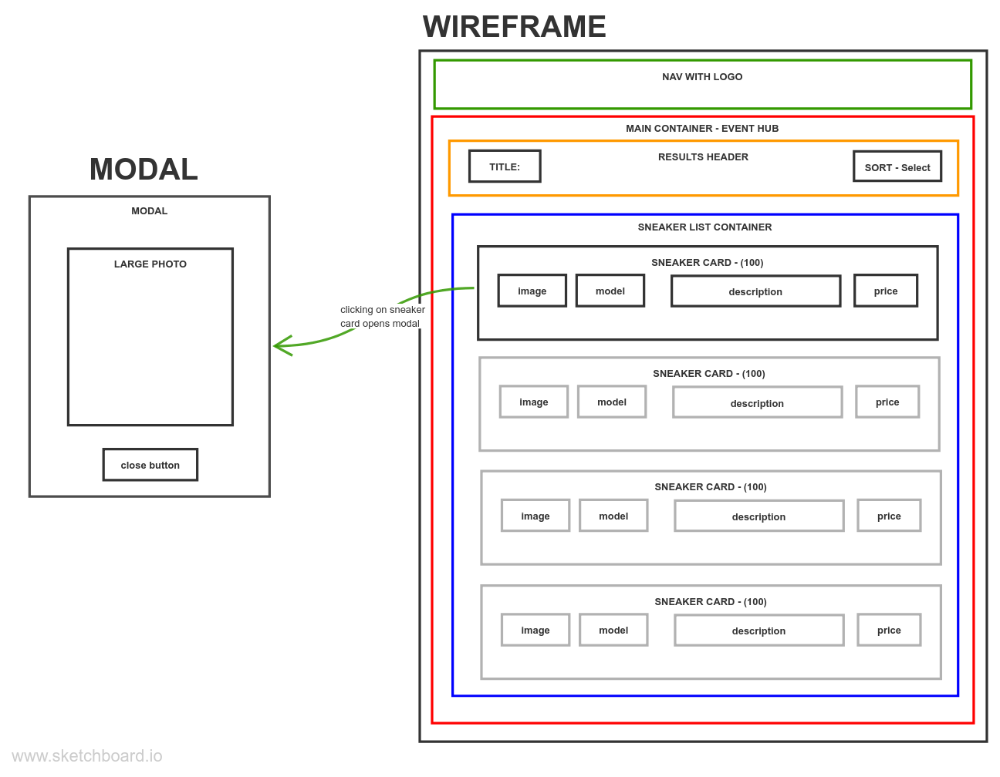

# SNEAKERHEAD - Class Demo

Simple app demonstrating the following fundamental javascript concepts:

- ES6 modules - import/export
- fetching data from an API
- event listeners
- dispatching custom events with data
- sorting array data
- converting objects to HTML representations
- rendering HTML to DOM
- simple modal/popup functionality
- CSS variables

### Browser Preview

## Visualizations

